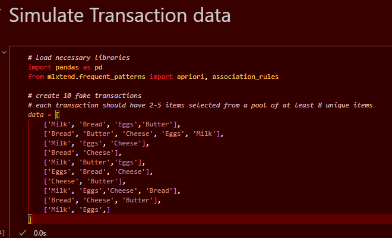
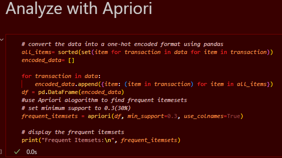
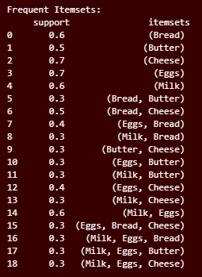
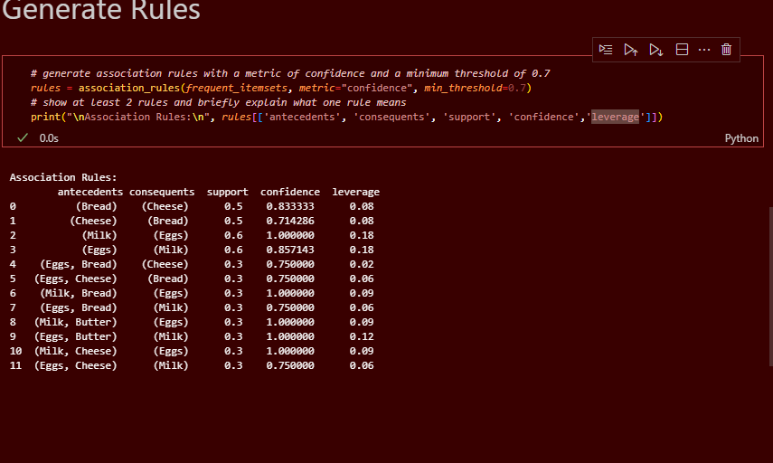

# Mitchel-association-mini
Simulate basic transactional data and use association rules to uncover shopping patterns.

# Association rules
A data mining technique used to discover interesting relationships,patterns or correlations among items in large dataset, typically transactional data such as market analysis.

**Simulate Transaction**

**Analyze with Apriori**
is an algorithm used in data mining to identify frequent itemsets in transactional datasets and generate association rules.

**Generate the rules**
Choose 3 rules:
- Support
- Confidence
- Leverage

# The rule I chose:
**Leverage**
Leverage in association rules is used in real life to assist organisations find item pairings that happen together more frequently than they should by accident.  For instance, this high leverage indicates a significant association if consumers often purchase bread and butter together far more than would be expected from their individual purchase rates.  By putting related products close to one another, making bundle deals, or enhancing their marketing tactics, retailers can use this information to boost sales and consumer happiness.

